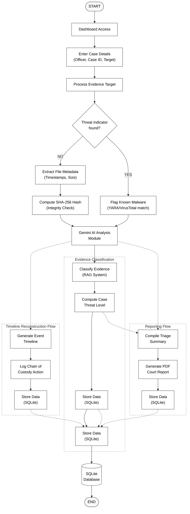

# Cyber Forensic Triage Software - Activity Diagram

```mermaid
flowchart TD
    %% Node Styles
    classDef startEnd fill:#f9f9f9,stroke:#333,stroke-width:1px,rx:20,ry:20,color:#000;
    classDef process fill:#fff,stroke:#333,stroke-width:1px,color:#000;
    classDef decision fill:#fff,stroke:#333,stroke-width:1px,color:#000;

    A([START]):::startEnd
    B[Dashboard Access]:::process
    C["Enter Case Details\n(Officer, Case ID, Target)"]:::process
    D[Process Evidence Target]:::process

    E{"Threat indicator\nfound?"}:::decision

    F["Extract File Metadata\n(Timestamps, Size)"]:::process
    G["Compute SHA-256 Hash\n(Integrity Check)"]:::process
    
    H["Flag Known Malware\n(YARA/VirusTotal match)"]:::process

    I["Gemini AI Analysis\nModule"]:::process

    %% Main Flow
    A --> B
    B --> C
    C --> D
    D --> E

    E -- NO --> F
    F --> G
    G --> I

    E -- YES --> H
    H --> I

    %% Branches
    subgraph Col1 [Timeline Reconstruction Flow]
        direction TB
        J1["Generate Event\nTimeline"]:::process
        K1["Log Chain of\nCustody Action"]:::process
        L1["Store Data\n(SQLite)"]:::process
        J1 --> K1
        K1 --> L1
    end

    subgraph Col2 [Evidence Classification]
        direction TB
        J2["Classify Evidence\n(RAG System)"]:::process
        K2["Compute Case\nThreat Level"]:::process
        L2["Store Data\n(SQLite)"]:::process
        M2["Store Data\n(SQLite)"]:::process
        J2 --> K2
        K2 --> L2
        L2 --> M2
    end

    subgraph Col3 [Reporting Flow]
        direction TB
        J3["Compile Triage\nSummary"]:::process
        K3["Generate PDF\nCourt Report"]:::process
        L3["Store Data\n(SQLite)"]:::process
        J3 --> K3
        K3 --> L3
    end

    %% Routing to columns (creating the visual split)
    I -.-> J1
    I --> J2
    I -.-> J3

    %% Cross-Flow Data Logging simulating the provided diagram mapping
    L1 -.-> M2
    K2 -.-> J3
    L3 -.-> M2
    L2 -.-> M2

    DB[("SQLite\nDatabase")]:::process

    M2 --> DB
    DB --> END([END]):::startEnd
    
    %% Style the groups
    style Col1 fill:none,stroke:#888,stroke-width:1px,stroke-dasharray: 4 4
    style Col2 fill:none,stroke:#888,stroke-width:1px,stroke-dasharray: 4 4
    style Col3 fill:none,stroke:#888,stroke-width:1px,stroke-dasharray: 4 4
```

*Figure: Activity Diagram of Cyber Forensic Triage Software*
